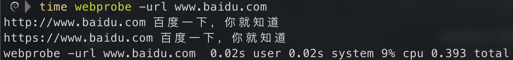
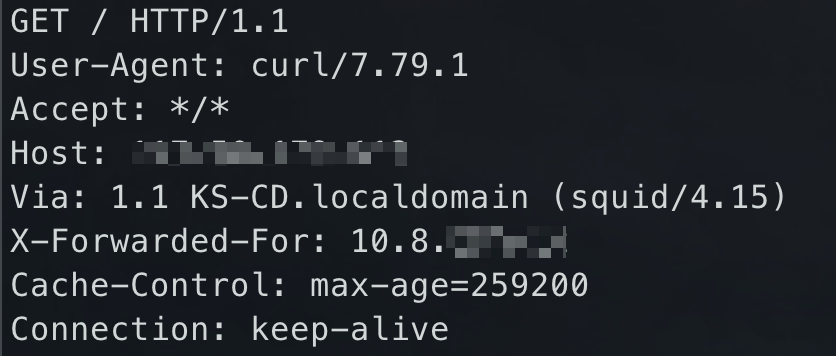
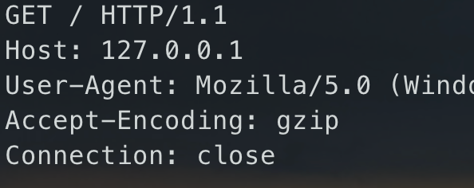

## webprobe

    

**一款快速探测web存活并获取title的工具**，目前主要是适配我自己，只探测80和443端口，后面有需要再调整


## Install

### 开箱即用

直接去[release](https://github.com/damit5/webprobe/releases)里面下载即可

### 手动编译

```shell
go get -v github.com/damit5/webprobe
```


## Usage

```
   webprobe
Usage of webprobe:


examples:
	 webprobe -url baidu.com
	 webprobe -file targets.txt
	 webprobe -file targets.txt -thread 100

  -file string
    	要检查的URL文件列表
  -proxy string
    	代理，如socks5://127.0.0.1:1080
  -thread int
    	线程 (default 100)
  -timeout int
    	超时时间 (default 3)
  -url string
    	要检查的URL
```




## 缘由

为什么已经这么多工具了，我还要再造个轮子？主要有如下几个原因：

1. 速度慢，效率低（主要原因）
2. 读取大文件全部加载到内存，导致内存压力太大直接宕机
3. 功能臃肿，导致启动时间很长，存在一些不必要的请求


## 速率对比

能修改线程的都修改为100，都只扫描80和443，`testtarget.txt`长度为100

### webprobe（当前工具）

```shell
webprobe -file testtarget.txt  0.36s user 0.56s system 20% cpu 4.425 total
```


### httpx

```shell
httpx -l testtarget.txt -t 100 -p http:80,https:443 -title  0.41s user 0.65s system 7% cpu 14.534 total
```


### bscan

```shell
./bscan_darwin_amd64 -ports 80,443 -target testtarget.txt -threads 100  4.82s user 0.69s system 147% cpu 3.742 total
```


### ehole

```shell
./ehole_test finger -l testtarget.txt --thread 100  0.41s user 0.40s system 4% cpu 20.032 total
```

## 坑点

### 数据包问题

公司的网络环境在经过网关的时候会自动加上奇怪的header头，调试了半天，还以为是GO的问题，还好破案了，太坑了




正常情况下，该工具的数据包应该长这样



### DNS问题

有时候并发太大了，会出现 `dial tcp: lookup xxxxxxx no such host` 这种DNS类的问题，linux下修改 `/etc/resolv.conf`，改一下DNS服务器的地址可能就行了

```shell
# 腾讯
119.29.29.29
182.254.116.116

# 114DNS
114.114.114.114
114.114.114.115

# 阿里
223.5.5.5
223.6.6.6

# Google
8.8.8.8
8.8.4.4
```


